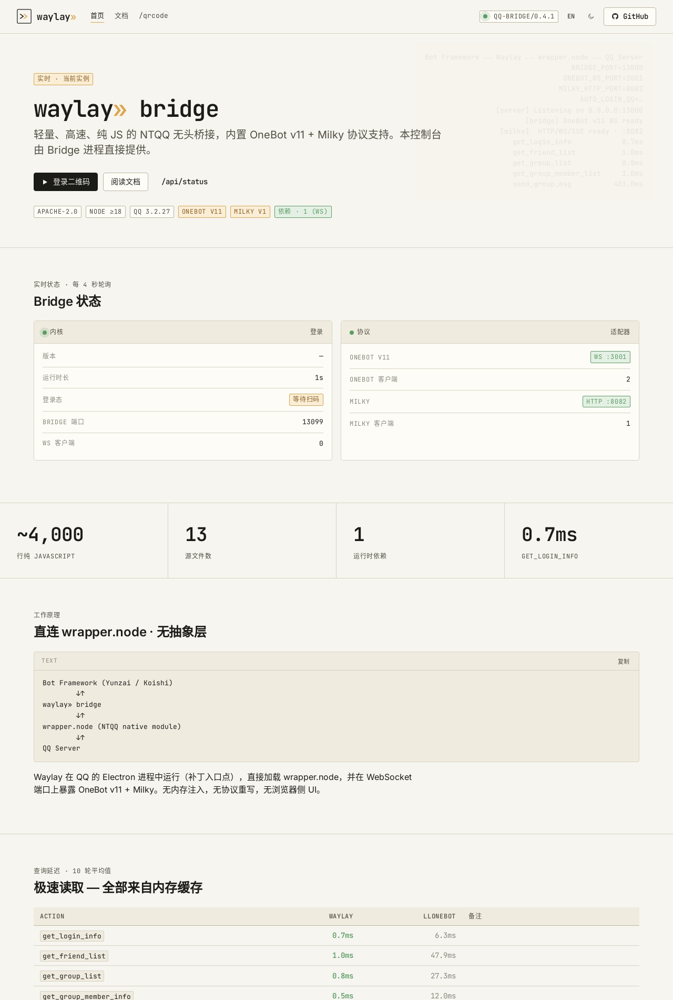
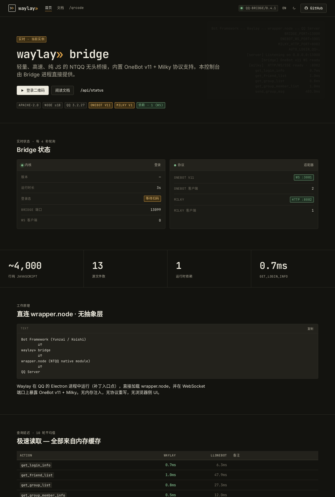
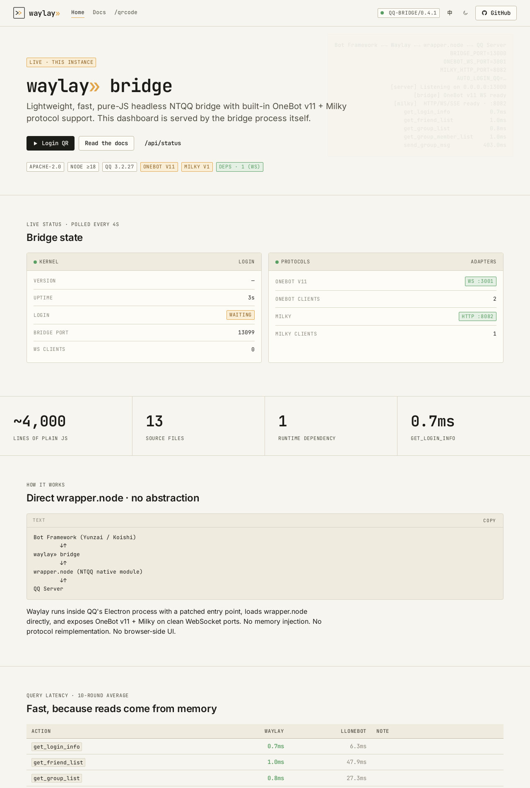
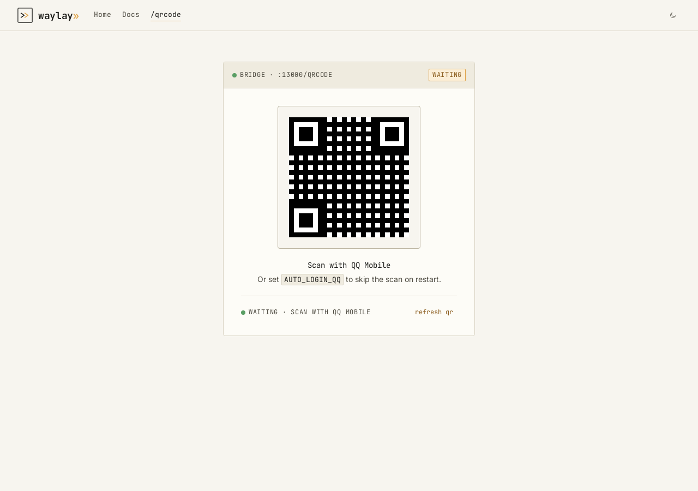
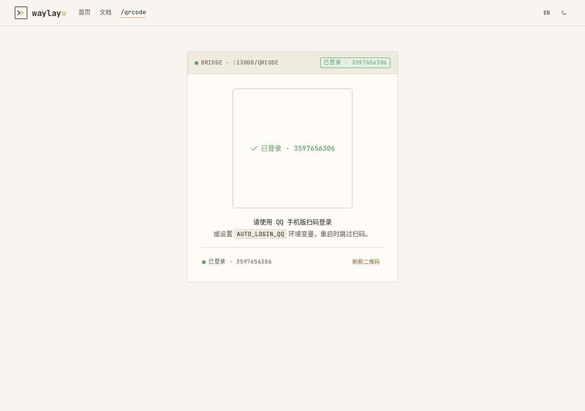

# Waylay Web Console — Screenshots & Design Notes

This folder is the visual reference for the bridge's built-in web console, served directly by `src/server.js` from the static files under `src/web/`. It implements the **Waylay design system** — terminal-inspired, monospace-forward, single warm-amber accent.

The console runs on the Bridge port (default `13000`, host `0.0.0.0`); start the container and open `http://<host>:13000/`. Long-form documentation (guides, protocol reference, action list, framework integration) lives at [waylay-wiki.micuks.click](https://waylay-wiki.micuks.click/) — the console only renders status that is bound to the running instance.

The UI is bilingual: default `zh`, toggle to `en` via the header `中`/`EN` button. Theme toggle (Parchment ⇄ Obsidian) sits next to it.

## Screens

### Landing — Parchment (light, zh)

`GET /` with `Accept: text/html` (any browser). The page mixes brand, live `/api/status` polling, an ASCII architecture diagram, and the latency comparison table — every visible string is localized.



### Landing — Obsidian (dark, zh)

Same page with `?theme=dark` (or after toggling the moon/sun icon). Both themes share every component — only the palette tokens swap.



### Landing — English

`?lang=en` (or after clicking the `EN` button) flips every translatable string. Brand mark, env vars, and code samples stay constant.



### Login — waiting

`GET /qrcode` (HTML). Shows the live QR PNG returned by `/qrcode.png`, with auto-refresh and a status pill that updates from `/api/status`.



### Login — logged in

After `/api/status` reports `logged_in: true`, the QR is replaced by a green confirmation overlay; the header pill and footer status both reflect the bound `uin`.



## Design tokens

Tokens live in `src/web/static/design.css`. Highlights:

| Token | Value | Use |
|---|---|---|
| `--wl-accent` | `#E0A44A` warm amber | links, focus rings, brand mark accent stroke, protocol-OK badges |
| `--wl-bg-0` / `--wl-bg-1` / `--wl-bg-2` | Parchment 2–4% steps | page / card / inset (light) |
| `--wl-bg-0` (dark) | `#13130F` Obsidian | dark-mode page |
| `--wl-fg-1/2/3` | Near-black ink + two dim steps | primary / secondary / hint |
| `--wl-rule` | `#D8D2C2` | 1px hairline, the only allowed separator |
| `--wl-r-sm` | 4px | cards, inputs, code blocks (`xs` 2 / `md` 8 reserved for badges / dialogs) |
| `--wl-font-mono` | JetBrains Mono | CLI copy, env vars, action names, table headers, the wordmark |

No gradients, no glassmorphism, no glow shadows. Only two shadow tokens exist (`--wl-shadow-lift` for popovers, `--wl-shadow-modal` for dialogs) — buttons, cards and inputs deliberately do not use them.

## Brand assets

Under `src/web/assets/` and served as `/assets/*`:

- `waylay-mark.svg` — square mark, two stacked chevrons (front in `currentColor`, accent in amber). Use on light backgrounds.
- `waylay-mark-dark.svg` — same mark inverted for dark backgrounds.
- `waylay-wordmark.svg` — mark + `waylay` set in JetBrains Mono 32/600.
- `favicon.svg` — inverted favicon, 64×64 with 6px rounded corners.
- `protocol-chevron.svg` — the `»` glyph used as a brand bullet/arrow.
- `status-dot.svg` — single-color dot at `currentColor`.

## Regenerating the screenshots

The screenshots above are deterministic. To regenerate (Chrome required):

```bash
# 1. Run the bridge (or the /tmp/wl-serve.js stub harness used in dev)
node src/index.js
# 2. Snap the pages
google-chrome --headless=new --no-sandbox --hide-scrollbars \
  --virtual-time-budget=6000 --window-size=1280,1900 \
  --screenshot=docs/screenshots/landing-light.png \
  'http://localhost:13000/?theme=light'
```

Repeat with `?theme=dark`, `?lang=en`, `/qrcode?theme=light`. Window sizes used in this folder: `1280×1900` (landing), `1280×900` (QR).
